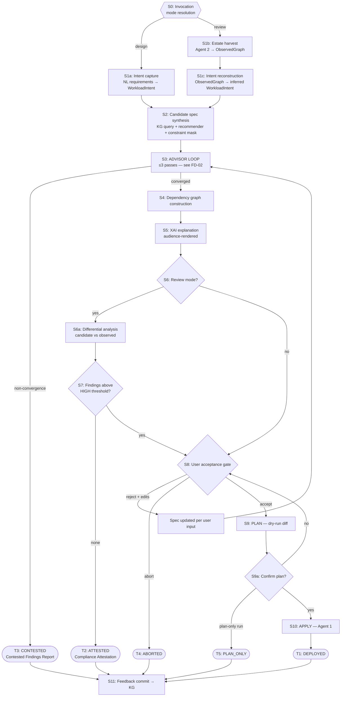

# FD-01 — Unified Flow Specification

**Project:** Knowledge Graph-Based Cloud Configuration Recommendation Framework for Financial Enterprises using Explainable AI and Agentic Subsystems. 
**Document ID:** FD-01
**Status:** Baseline — supersedes the two-condition flowcharts
**Depends on:** FD-02 (Advisor Iteration Policy), FD-03 (Feedback Capture)
**Open decisions referenced:** D2 (scope breadth), D5 (deployment artifact format)

---

## 1. Purpose

This document defines the single execution pipeline that both user-facing operations resolve to. It replaces the two independent flowcharts with one specification in which the operating modes differ **only in how a candidate specification is originated**, and are identical from that point forward.

It is the controlling reference for the CLI implementation, the sequence diagrams in the dissertation, and the architecture chapter of the Cloud Architecture & Design submission.

---

## 2. Design principle: one spine, two entry modes

The original flowcharts described two workflows that independently arrived at the same six-step tail: *finalize spec → advisor review → gate → dependency graph → user acceptance → deploy*. Duplication of that tail is both an engineering liability (two code paths to keep consistent) and an analytical weakness (it obscures the fact that the two operations are the same operation).

The unifying observation:

> **Designing a configuration and reviewing a configuration are the same problem with different inputs.** In both cases the system must arrive at a specification, defend it, and hand it to a human for disposition. Design begins from a stated intent. Review begins from a *reconstructed* intent inferred from an existing deployment.

This reframing produces the central architectural claim of the project — that a review is a design whose intent has been recovered rather than supplied — and it is what makes the Condition 2 intent-reconstruction step a research contribution rather than a preprocessing chore (§7).

---

## 3. Actors

| Actor | Type | Responsibility | Trust boundary |
|---|---|---|---|
| **User** | Human | Supplies intent or triggers review; sole authority for the acceptance gate | Outside system |
| **Harvester (Agent 2)** | Autonomous, read-only | Fetches live configuration state from target AWS accounts; maps it into the graph | Cross-account read role |
| **Recommender** | Model | Proposes configuration options for a given intent; ranked, constraint-masked output | Internal |
| **Advisor** | Model + rules, KG-backed | Adversarially reviews the candidate spec against normative controls; issues severity-tagged findings | Internal |
| **Explainer (XAI)** | Model | Extracts the minimal sufficient justification subgraph; renders it per audience | Internal |
| **Provisioner (Agent 1)** | Autonomous, write | Emits deployment artifact, executes plan and apply | Cross-account write role — **highest risk component** |
| **Knowledge Graph** | Store | Normative controls, service topology, cost facts, observed estates, behavioural feedback | Internal |

**Separation-of-duties note.** The Advisor must not be the same component as the Recommender, and must not be given the Recommender's reasoning trace as input. If the reviewer inherits the proposer's rationale, review collapses into self-agreement — the failure mode documented for single-model self-critique. The Advisor sees only the *artifact*, never the *argument*. This mirrors the three-lines-of-defence model used in financial institutions and should be presented as such.

---

## 4. Pipeline



### Changes from the original flowcharts

| # | Original behaviour | Unified behaviour | Rationale |
|---|---|---|---|
| 1 | Advisor rejection → implement suggestions → proceed, no re-review | Bounded loop, ≤3 passes, severity-gated | A single unreviewed patch pass gives no assurance the fix is correct. See FD-02. |
| 2 | C1 user-rejection loops to advisor review; C2 loops to XAI stage | Both loop to **S3, advisor review** | Asymmetry was unintentional. A user-edited spec is an unreviewed spec and must re-enter review. |
| 3 | XAI present only in Condition 2 | XAI runs on **both** paths (S5) | A newly designed configuration must be defensible to an auditor exactly as much as an inherited one. Explanation is not a defect-reporting feature. |
| 4 | Condition 2 always produced a remediation spec | Clean-bill branch → **T2 ATTESTED** | An estate with no material findings should terminate with positive evidence, not a forced change. For the compliance-officer persona this is the *primary* output. |
| 5 | Agent 1 deploys directly | Mandatory **PLAN → confirm → APPLY** | Irreversible writes to live accounts require a reviewable diff. Also the principal control on AWS credit burn. |
| 6 | STOP was terminal | All five terminal states write a run record (S11) | Accept/reject decisions and user edits are the highest-value learning signal available. See FD-03. |

---

## 5. Stage specifications

### S0 — Invocation and mode resolution
**In:** CLI invocation. **Out:** `mode ∈ {design, review}`, target account context, audience flag.
Mode is explicit (`kgcr design` / `kgcr review`), not inferred. Audience defaults to `architect`.

### S1a — Intent capture *(design mode)*
**In:** Natural-language requirement statement and/or structured flags.
**Out:** `WorkloadIntent` — a typed object: workload archetype, data classification, throughput/latency targets, availability target, regulatory scope, budget ceiling, region constraints.
The LLM performs *extraction into a fixed schema*, not free reasoning. Any field it cannot ground is left null and elicited interactively. Silent defaulting is prohibited — an unstated availability requirement must not become a silently assumed one.

### S1b — Estate harvest *(review mode)*
**In:** Target account(s). **Out:** `ObservedGraph`.
Agent 2 uses read-only cross-account roles against AWS Config, CloudTrail, IAM, and Cost & Usage data. Strictly read-only; this is enforced by IAM policy, not by convention.

### S1c — Intent reconstruction *(review mode)*
**In:** `ObservedGraph`. **Out:** `WorkloadIntent` with per-field confidence scores.
Infers what the estate was *trying to be*. Low-confidence fields are surfaced for user confirmation rather than assumed. See §7 — this is a named research contribution and must be evaluated independently.

### S2 — Candidate spec synthesis
**In:** `WorkloadIntent`. **Out:** `CandidateSpec`.
Three sub-steps, in order:
1. **Retrieve** — graph query for configuration options linked to the intent's archetype and regulatory scope.
2. **Rank** — learned recommender scores candidate options.
3. **Mask** — hard constraint filter removes any option violating a CRITICAL control **before** ranking is returned.

The masking step must be applied as a filter on the output, not as a training objective. A model that has merely *learned* to avoid illegal configurations can still emit one; a filter cannot. This distinction is worth stating explicitly in the AI submission.

### S3 — Advisor review loop
Fully specified in **FD-02**. Summary: ≤3 passes, early exit on zero findings, fixed-point halt on oscillation, CRITICAL findings block progress, non-convergence terminates at T3.

### S4 — Dependency graph construction
**In:** Converged spec. **Out:** Typed, directed dependency graph over the specified resources — provisioning order, network reachability, trust relationships, data-flow paths.
This artifact serves three consumers: Agent 1 (ordering), the Explainer (justification substrate), and the differential analyser (S6a).

### S5 — XAI explanation
**In:** Spec + dependency graph + advisor findings. **Out:** `ExplanationBundle`.
Contains the minimal sufficient subgraph per recommended element, the control clause each element satisfies, cost and risk deltas, and counterfactuals ("removing X saves $N/month and forfeits control C").

**Invariant INV-2:** the audience flag (`architect` / `auditor` / `learner`) changes *rendering only*. The underlying subgraph, findings, and conclusions are byte-identical across renderings. If audience alters what the system concludes, the system is performing persuasion, not explanation. This invariant must be tested, not merely asserted.

### S6a — Differential analysis *(review mode)*
**In:** `CandidateSpec`, `ObservedGraph`. **Out:** `FindingSet`.
Three finding classes:
- **Divergence** — observed differs from recommended.
- **Violation** — observed breaches a normative control outright.
- **Relational violation** — observed breaches a control only via a multi-hop path (e.g. bucket is private *and* role is over-permissive *and* instance is public ⇒ exfiltration path exists).

The third class is the empirical demonstration that the graph is load-bearing. Single-resource policy engines cannot produce these findings by construction. A dedicated evaluation set for relational findings is required.

### S7 — Disposition branch
Zero CRITICAL and zero HIGH findings → **T2 ATTESTED**. Otherwise → S8 with a remediation spec.

### S8 — User acceptance gate
Sole human authority. Three outcomes: accept → S9; reject with edits → S8a → **back to S3**; abort → T4.
Rejections and edits are captured verbatim (FD-03) — they are corrections to the model's output and the most informative signal the system collects.

### S9 — Plan
**Out:** Dry-run diff — resources to create/modify/destroy, cost delta, control-coverage delta, blast-radius summary.
**Invariant INV-3:** no apply without a preceding plan in the same run.

### S10 — Apply
Agent 1 executes. Failure mid-apply must leave a recorded partial state; rollback semantics are inherited from the deployment artifact (D5, deferred).

### S11 — Feedback commit
Every terminal state writes a run record. Specified in FD-03.

---

## 6. Terminal states

| ID | State | Emitted artifact | Primary persona |
|---|---|---|---|
| **T1** | DEPLOYED | Applied config + explanation bundle + audit record | Architect |
| **T2** | ATTESTED | Compliance Attestation: spec, dependency graph, control-coverage matrix, timestamp, no changes made | Auditor |
| **T3** | CONTESTED | Contested Findings Report: unresolved CRITICAL findings with both positions stated | Auditor / escalation |
| **T4** | ABORTED | Run record only | — |
| **T5** | PLAN_ONLY | Plan diff + explanation bundle, no changes made | Architect / learner |

T3 deserves emphasis in the writeup. A system that reports *"the generator and the reviewer could not agree, and here is precisely where"* is more trustworthy to an auditor than one that always produces an answer. Graceful non-convergence is a feature, and it distinguishes this design from tools that must always return something.

---

## 7. Named contribution: intent reconstruction (S1c)

Stage S1c is the least tractable and most publishable component of the pipeline.

**Problem.** Given only a deployed estate, recover the workload intent that would have produced it. The mapping is many-to-one and lossy: multiple intents can produce the same deployment, and deployments contain accidents, drift, and dead resources that reflect no intent at all.

**Why it matters.** Without reconstructed intent, review degenerates into rule-matching against a fixed checklist — precisely what existing CSPM tooling already does. With it, the system can ask the strictly harder and more useful question: *given what this estate appears to be for, is this a good configuration?*

**Approach.** Graph-structural classification over the observed subgraph (topology, service composition, tagging, traffic patterns, IAM shape) into workload archetypes, with per-field confidence and mandatory user confirmation below threshold.

**Evaluation.** Round-trip fidelity — generate a synthetic estate from a known intent, reconstruct, and measure recovery accuracy per field. Because the synthetic corpus (FD-05) is generated *from* intents, ground truth is free. This is a clean, defensible experiment and should be presented as a standalone result.

**Honest limitation to state in the writeup.** Reconstruction is an inference, not an observation. The framework must never present a reconstructed intent as fact, and low-confidence reconstructions must degrade to user elicitation rather than silent assumption.

---

## 8. System invariants

| ID | Invariant |
|---|---|
| **INV-1** | No specification containing an unresolved CRITICAL finding reaches S9. |
| **INV-2** | Audience selection alters rendering only; reasoning and conclusions are identical across renderings. |
| **INV-3** | No APPLY without a PLAN in the same run. |
| **INV-4** | Every run reaches exactly one terminal state and writes exactly one run record. |
| **INV-5** | Agent 2 holds read-only credentials; Agent 1 is the only component with write capability. |
| **INV-6** | Any user-modified specification re-enters advisor review before deployment. |
| **INV-7** | The Advisor never receives the Recommender's reasoning trace, only its output artifact. |

These are testable properties, not aspirations. Each should map to at least one automated test — a straightforward way to give the implementation chapter genuine rigour.

---

## 9. CLI surface

```
kgcr design  --intent "<statement>" [--audience=<a>] [--plan-only] [--budget=<n>]
kgcr review  --account <id> [--audience=<a>] [--attest-only]
kgcr explain --run <run-id> [--audience=<a>]
kgcr plan    --spec <spec-id>
kgcr apply   --plan <plan-id>
kgcr history [--account <id>]
```

`explain` re-emits the justification for a past run without recomputation — the auditor's re-derivation path, and the reason explanation bundles must be persisted rather than regenerated.

CLI was chosen over a web UI deliberately: human-in-the-loop gates become natural prompts rather than modal dialogs; the tool is pipeline-composable, which is how a bank would actually consume it; and it prevents examiners from grading a dashboard instead of the reasoning engine.

---

## 10. Open items

| Ref | Item | Blocking |
|---|---|---|
| D2 | Scope breadth — number of workload archetypes and compliance frameworks | Corpus generation (FD-05) |
| D5 | Deployment artifact format — Terraform vs CloudFormation vs SDK | S9/S10 implementation |
| D6 | Explanation export format for audit systems (OSCAL assessment-results is the candidate) | S5 |
| D7 | Multi-account topology mapping onto the three available student accounts | Environment build |

---

## 11. References

1. AWS Well-Architected Framework and AWS Security Reference Architecture — normative source for reference configurations.
2. NIST SP 800-53 Rev. 5 and NIST OSCAL — control catalogue and machine-readable control encoding.
3. CIS Amazon Web Services Foundations Benchmark — configuration-level control baselines.
4. PCI-DSS v4.0 — regulatory scope for the payments archetype.
5. EDM Council, *Financial Industry Business Ontology (FIBO)* — domain ontology layer.
6. HashiCorp Terraform — plan/apply separation as the reference model for gated infrastructure change.
7. Ying, Z. et al. (2019). *GNNExplainer: Generating Explanations for Graph Neural Networks.* NeurIPS.
8. Institute of Internal Auditors — three-lines-of-defence model, basis for proposer/reviewer separation.
